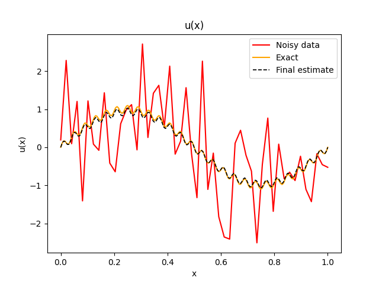

# Physics-Informed Neural Networks with Fourier Embedding



This repository provides a modular, user-friendly implementation of Physics-Informed Neural Networks (PINNs) for solving 1D partial differential equations (PDEs) with multi-scale and multi-frequency behavior. The main focus is on overcoming spectral bias using Fourier feature embeddings, enabling the network to efficiently learn both low- and high-frequency components from noisy or limited data.

## Features

- Modular, well-commented code for easy customization
- Deterministic and reproducible results (random seeds, device, and dtype handling)
- User can specify their own data, domain, collocation points, and Fourier frequencies
- Example usage with synthetic data included
- Easy to adapt to new PDEs and datasets

## How to Use

### 1. Install Dependencies

Install the required Python packages individually (recommended for full control):

```bash
pip install torch numpy matplotlib pyDOE rff
```

If you want to use a CUDA-enabled GPU, install the correct PyTorch version for your system. Visit [PyTorch Get Started](https://pytorch.org/get-started/locally/) and select your CUDA version. For example, for CUDA 11.8:

```bash
pip install torch torchvision torchaudio --index-url https://download.pytorch.org/whl/cu118
```

### 2. Run the Example

To run the default synthetic example (multi-frequency PDE):

```bash
python PINN_Fourier_Embedding.py
```

This will train the PINN on a synthetic PDE and produce plots comparing the true solution, noisy data, and the PINN prediction.

### 3. Setting Up Your Own Problem

You can easily adapt the script to solve your own 1D PDE by modifying the following:

#### a. Data and Domain
- Replace the `prepare_synthetic_data` function with your own data loading/generation code.

#### b. Fourier Frequencies
- At the top of the script, change the `FREQUENCIES` and `ENCODED_SIZE` variables to set the desired Fourier bases. For example:
  ```python
  FREQUENCIES = [2, 10, 50]  # Add or remove frequencies as needed
  ENCODED_SIZE = 2           # Number of random features per frequency
  ```
- The script will automatically use these frequencies for the Fourier embedding.

#### c. PDE Definition
- To solve a different PDE, modify the `lossPDE` method inside the `PINN` class. The line:
  ```python
  f = ...  # Define your PDE residual here
  ```
  should be replaced with the residual of your own PDE, using the computed derivatives (`u_x`, `u_xx`, etc.).
- You can use `autograd.grad` to compute higher-order derivatives as needed.

#### d. Training Parameters
- Adjust the number of epochs, learning rate, hidden units, etc., in the call to `train_PINN` in the main block.

### 4. Saving and Plotting

- Trained models are saved in the `models/` directory.
- Plots are saved in the `images/` directory and also displayed interactively.


## Troubleshooting

- If you encounter device or dtype errors, ensure all tensors are moved to the correct device and dtype before training.
- For full determinism, keep the seeding and Fourier encoder creation order unchanged.

## References

- For theory and background, see the [accompanying report](https://github.com/LorenzoFaccioli999/Physics_Informed_Neural_Networks/blob/main/PINN_report.pdf).

---
For questions or contributions, please open an issue or pull request.
